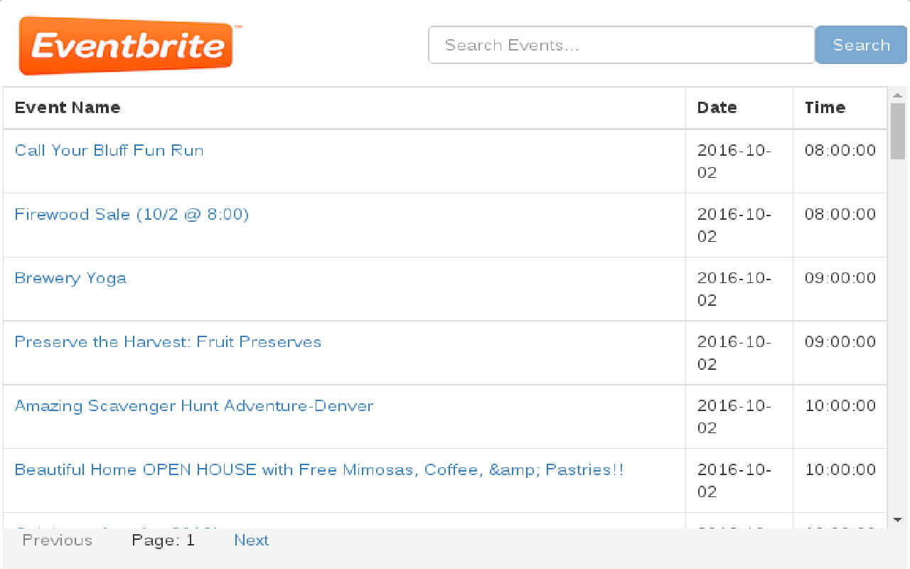

# Popular Events on Eventbrite

A Chrome app to display the popular events on Eventbrite by location. Two versions of this app exist.
* The older version, written in `Angular.js`, and gives the option of searching by a particular location, or using the current location.
* The newer version, written in `React.js`, and allows searching for events.

### Features

* Getting the popular events from eventbrite
* HTML5 geolocation support.
* Pagination support
* Stores OAuth token in HTML5 local storage, in order to avoid repeatedly acquiring the token

### Installation:

##### v1.0
1. Run bower install inside eventbrite-popular-events to install the frontend dependencies

2. Use Chrome Extension Manager to install the extension by using 'Load unpacked extension', and pointing to the directory containing the files.

##### v2.0
* Navigate to `eventbrite-events-react` directory
* run `npm install` to install the required node modules
* run `bower install` to install `jQuery`
* run `node node_modules/webpack/bin/webpack` to generate the required scripts inside `dist` folder.
* use the Chrome Extension manager to install the extension, using 'Load unpacked extension', and pointing to the directory containing the files.

### Dependencies:

##### v1.0
* Angular.js (v1.4.8)
* angular-spinner
* Bootstrap (v3.3.6)

##### v1.1
* React.js - v15.3.1
* jQuery
* Bootstrap

### Screenshots:

##### v1.0

##### v2.0

