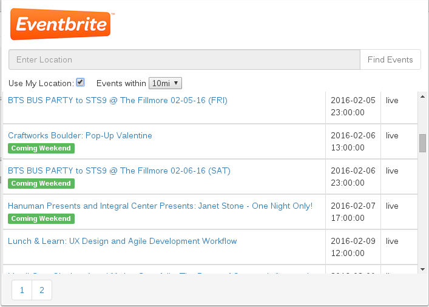

# Popular Events on Eventbrite

A Chrome app to display the popular events on Eventbrite by location. Enter the location to get a list of popular events. An alternative to this would be to use your current location to get the events.

### Features

* Getting the popular events from eventbrite
* HTML5 geolocation support. Can filter the location from 10, 20, 30 miles
* Pagination support
* Shows the events in the coming weekend with the label 'Coming Weekend'
* Storing OAuth token in HTML5 local storage, in order to avoid repeatedly acquiring the token

### Installation:

1. Run bower install inside eventbrite-popular-events to install the frontend dependencies

2. Use Chrome Extension Manager to install the extension by using 'Load unpacked extension', and pointing to the directory containing the files.

### Dependencies:

* Angular.js (v1.4.8)
* angular-spinner
* Bootstrap (v3.3.6)

### Screenshots:

